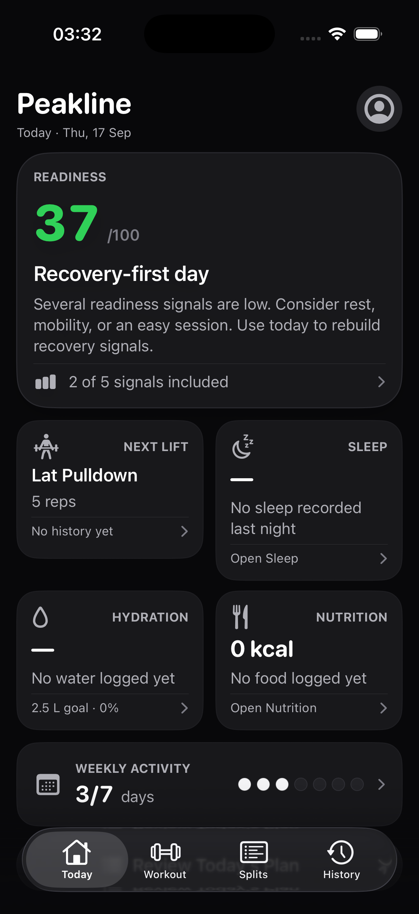
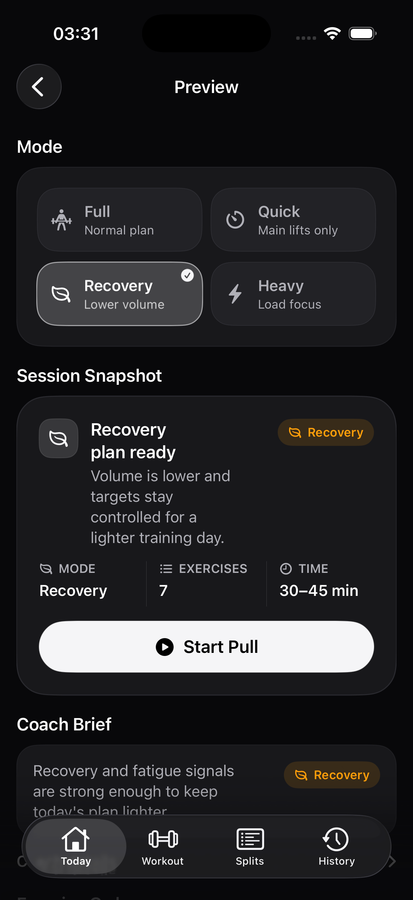
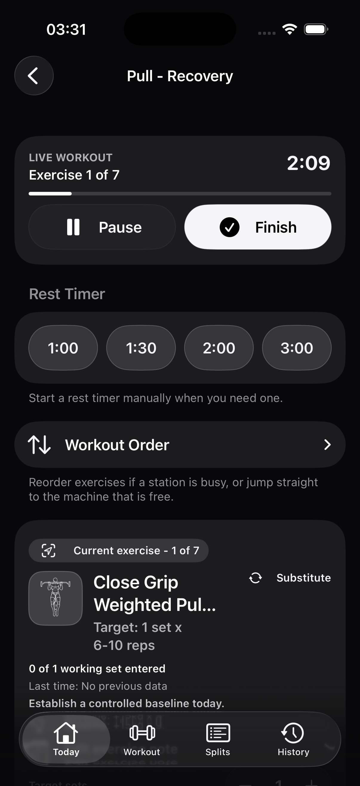
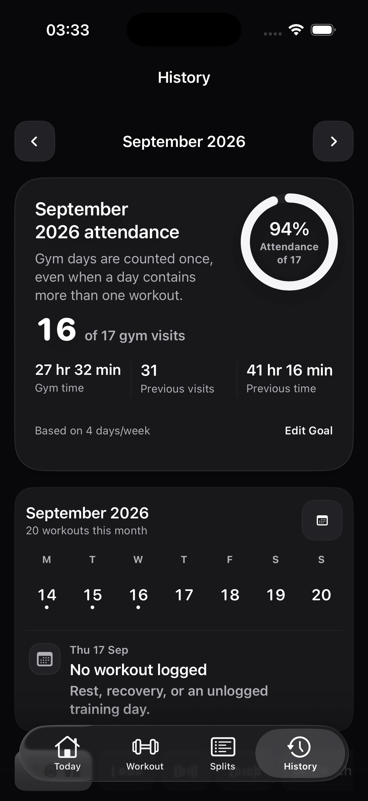

# Peakline

[](https://github.com/noelpat-dev/Peakline/actions/workflows/ios-ci.yml)


Peakline is a local-first iOS lifting coach I am building to make the training loop clearer and more useful:

1. Decide what to train next.
2. Preview and adjust the session.
3. Log the workout quickly.
4. Review what happened.
5. Use that history to choose a better next target.

The product is designed for the gym rather than for a social feed. It keeps the core workout path fast, makes coaching explainable, and treats personal training data as local source-of-truth data.

> Peakline is an active portfolio project by [Noel](https://github.com/noelpat-dev). It is being developed as a production-minded app, with particular attention to SwiftUI responsiveness, persistence safety, accessibility, and honest product boundaries.

## Product tour

| Decide | Preview | Log | Review |
| --- | --- | --- | --- |
|  |  |  |  |

[Watch the compact Decide → Preview → Log → Review simulator demonstration](docs/media/peakline-demo.mp4). All media uses Peakline's synthetic UI-test store.

## What Peakline does

### Training and workouts

- Maintains an editable Push, Pull, Legs, Upper, and Lower training rotation.
- Recommends the next meaningful workout consistently across Today, Coach, Workout, Splits, Progress, and History.
- Supports Full, Quick, Recovery, and Heavy workout modes.
- Provides a detailed workout preview with target suggestions, last-best-set context, alternatives, notes, addable exercises, real handle-based reordering, and history-calibrated duration ranges.
- Offers fast live logging with set entry, rest timing, pause/resume, substitutions, skipped-exercise reasons, long-session confirmation, completion rating, and a prepared session summary.
- Supports workout templates, recent-session repeat, exercise notes, and a metric plate calculator.
- Includes an offline Exercise Guide with 302 illustrated movements, equipment/muscle filters, and three selectable poses per exercise; matching workout rows use the same theme-aware artwork.

### Coaching and progress

- Uses deterministic local rules instead of opaque or remote AI calls.
- Explains progression targets and readiness recommendations with the evidence available on the device.
- Includes readiness scoring, recovery guidance, weekly review, action history, deload context, and feedback capture.
- Keeps History useful with a current-month visit goal, attendance markers, filters, session details, duration correction, and deletion flows.
- Shows best sets, estimated 1RM, best-set volume, set history, charts, and a PR timeline.

### Nutrition, recovery, and data ownership

- Tracks nutrition, optional fibre targets, hydration, and a state-led Sleep experience with overnight history, Sleep Mode, manual entries, naps, recovery context, and an optional truthful HealthKit bridge.
- Supports barcode lookup, Open Food Facts import, nutrition-label OCR, parser review, and source comparison before imported data is saved.
- Treats HealthKit as optional and degrades gracefully when permission or device data is unavailable.
- Supports local JSON/workout CSV export and encrypted account-linked Firebase backup for reinstall recovery.
- Keeps the real Firebase configuration out of source control; the app can still run in local-only mode.

## Engineering highlights

- **Local-first architecture:** SwiftData is the fast local source of truth. Firebase stores an encrypted backup copy rather than becoming a dependency for everyday navigation or logging.
- **Prepared value snapshots:** startup and performance-sensitive routes prepare immutable value-backed snapshots before navigation, reducing repeated SwiftData traversal and keeping the first actionable frame responsive.
- **Deterministic coaching:** target suggestions, training rotation, readiness evidence rules, and recommendation copy are testable local services with bounded certainty.
- **Performance as a feature:** the repository includes a focused acceptance verifier for route timing, warm-cache reuse, duplicate refreshes, notification work, UI timeouts, and unsafe synchronous SwiftData access.
- **Shared design system:** semantic theme tokens, Dynamic Type-backed typography, native navigation, 44-point controls, restrained motion, and Reduce Motion/Reduce Transparency fallbacks are shared across the major app surfaces.
- **Reliability coverage:** unit and UI tests cover workout logging, backup/restore, nutrition export, coaching, warm-start snapshots, History, Splits, scanner navigation, and lifecycle behavior.

## Technical stack

| Area | Choice |
| --- | --- |
| Platform baseline | iOS 17.0 |
| UI | SwiftUI |
| Persistence | SwiftData |
| Charts | Swift Charts |
| Coaching | Deterministic local services |
| Backup | Firebase Authentication + Cloud Firestore |
| Backup security | On-device compression and passphrase encryption |
| Health data | Optional HealthKit bridge |
| CI | GitHub Actions on macOS with Xcode |

## Architecture at a glance

```text
SwiftUI views
    ↓ present state and collect input
Feature services
    ↓ coaching, calculations, imports, exports, backup, snapshots
SwiftData models
    ↓ local source of truth
Prepared value snapshots
    ↓ stable, responsive navigation and rendering
Shared theme, motion, accessibility, and performance utilities
```

The feature overview above is the canonical product summary. Deeper implementation boundaries are documented in [Architecture](docs/architecture.md), with active priorities in the [Roadmap](docs/roadmap.md).

## Current status

The main lifting loop is implemented end to end and the app is in an active reliability and accessibility phase. Startup is readiness-led, routine logging transitions are nonblocking, History keeps one stable interactive hierarchy, Preview supports direct long-list reordering, and trend charts expose inspectable historical values.

The dated [verification record](docs/verification-2026-09-17.md) is the single source for the tested working tree, test totals, route samples, simulator configuration, and outstanding physical-device checks. Historical measurements are retained only where they explain a current risk.

## Run locally

Requirements:

- macOS with Xcode. The current repository was verified with Xcode 26.5.
- An iOS 17.0-or-newer simulator or device. The repeatable acceptance configuration uses the iPhone 17 simulator.
- A Firebase `GoogleService-Info.plist` only if account backup is being exercised. It is intentionally ignored by Git.

Open the project:

```bash
open GymTracker.xcodeproj
```

Then select the `GymTracker` scheme and an iOS 17-or-newer destination.

Command-line build:

```bash
xcodebuild \
  -project GymTracker.xcodeproj \
  -scheme GymTracker \
  -configuration Debug \
  -destination 'platform=iOS Simulator,name=iPhone 17' \
  build
```

For Noel's personal-device installs, the opt-in [iOS Auto Refresh](Scripts/PeaklineAutoRefresh/README.md) LaunchAgent can renew near-expiry development builds for catalogued apps such as Peakline and Kuro from the command line without opening Xcode. It processes apps serially, performs only same-identity in-place installs, and never uninstalls an app.

Performance-sensitive validation:

```bash
Scripts/verify_performance_acceptance.sh
```

The product and repository are branded **Peakline**. Existing Xcode project, scheme, source-directory, test-target, and bundle-identifier names still use `GymTracker` as a compatibility detail for the current local install and build setup; they are not separate products.

## Repository guide

- [Architecture](docs/architecture.md) — implementation map and architectural guardrails.
- [Design system](docs/design-system.md) — visual, interaction, accessibility, and motion standards.
- [Known issues](docs/known-issues.md) — known risks and regression boundaries.
- [Performance](docs/performance.md) — acceptance thresholds and verifier workflow.
- [Roadmap](docs/roadmap.md) — near-term priorities and longer-term ideas.
- [Engineering decisions](docs/engineering-decisions.md) — concise first-person decisions behind the implementation.
- [Verification record](docs/verification-2026-09-17.md) — dated build, test, interaction, and performance evidence.
- [SECURITY.md](SECURITY.md) — responsible reporting and release-safety boundaries.

The public tree is intentionally limited to the product source, tests, CI, canonical documentation, and portfolio-facing engineering notes needed to understand and run Peakline.

## Portfolio notes

Peakline is intentionally more than a collection of screens. The repository shows how I approach a growing SwiftUI product: establish clear ownership boundaries, keep persistence local and recoverable, measure hot paths, make uncertainty visible, and keep the experience usable under real gym conditions.

The next meaningful milestone is a focused physical-device acceptance pass, followed by continued reliability work around encrypted restore, nutrition imports, and safe SwiftData evolution.
